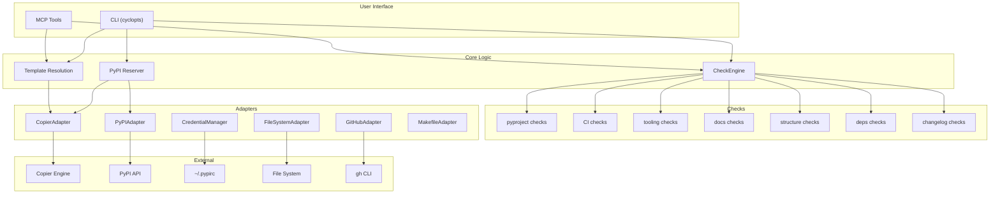

# Architecture

## Overview

`axm-init` follows a layered architecture with clear separation of concerns:

## Layers

### 1. CLI (`cli.py`)

Cyclopts-based commands with input validation and formatted output (text, JSON, agent).

| Command | Function | Description |
|---|---|---|
| `scaffold` | `scaffold()` | Scaffold a new project |
| `check` | `check()` | Score against AXM standard |
| `reserve` | `reserve()` | Reserve PyPI package name |
| `version` | `version()` | Show version |

### 2. Core Logic (`core/`)

Business logic independent of I/O:

| Module | Key Symbols | Purpose |
|---|---|---|
| `checker.py` | `CheckEngine`, `format_report()`, `format_json()`, `format_agent()` | Run checks, format output |
| `templates.py` | `TemplateInfo`, `get_template_path()` | Template catalog and resolution |
| `reserver.py` | `ReserveResult`, `reserve_pypi()` | PyPI name reservation workflow |

### 3. Checks (`checks/`)

39 checks across 7 categories, each a pure function `(Path) → CheckResult`:

| Module | Category | # Checks |
|---|---|---|
| `pyproject.py` | pyproject | 9 |
| `ci.py` | CI | 7 |
| `tooling.py` | tooling | 7 |
| `docs.py` | docs | 5 |
| `structure.py` | structure | 7 |
| `deps.py` | deps | 2 |
| `changelog.py` | changelog | 2 |

### 4. Adapters (`adapters/`)

Each adapter wraps a single external dependency:

| Adapter | Wraps | Purpose |
|---|---|---|
| `CopierAdapter` | `copier.run_copy()` | Template-based scaffolding |
| `PyPIAdapter` | PyPI JSON API | Package name availability check |
| `CredentialManager` | `PYPI_API_TOKEN` / `~/.pypirc` | Token retrieval and validation |
| `FileSystemAdapter` | `pathlib` | File operations with rollback |
| `GitHubAdapter` | `gh` CLI | Repo creation, secrets, Pages |
| `detect_makefile_targets()` | `Makefile` | Detect available make targets |

### 5. Models (`models/`)

Pydantic models for structured data exchange between layers:

| Model | Module | Purpose |
|---|---|---|
| `CheckResult` | `check.py` | Single check outcome (passed, message, fix) |
| `CategoryScore` | `check.py` | Aggregated score per category |
| `ProjectResult` | `check.py` | Full project check result |
| `Grade` | `check.py` | A–F grade enum |
| `ScaffoldResult` | `results.py` | Outcome of a scaffolding operation |
| `ProjectConfig` | `project.py` | Input project configuration |
| `ProjectMetadata` | `project.py` | Extracted project metadata |
| `CopierConfig` | `copier.py` | Input configuration for Copier |
| `ReserveResult` | `reserver.py` | Outcome of a PyPI reservation |

### 6. Tools (`tools/`)

MCP tool wrappers for AI agent integration. All tools satisfy the `AXMTool` protocol (imported from `axm.tools.base`).

| Tool | Class | Entry Point |
|---|---|---|
| `init_check` | `InitCheckTool` | `axm.tools` → `check` |
| `init_scaffold` | `InitScaffoldTool` | `axm.tools` → `scaffold` |
| `init_reserve` | `InitReserveTool` | `axm.tools` → `reserve` |

## Design Decisions

| Decision | Rationale |
|---|---|
| Hexagonal architecture | Testable core, swappable adapters |
| Pydantic models | Validation, serialization, `extra = "forbid"` |
| Copier for scaffolding | Jinja2 templates, supports project updates |
| `src/` layout | PEP 621 best practice, no import conflicts |
| Pure check functions | Each check is `(Path) → CheckResult`, easy to test and extend |
