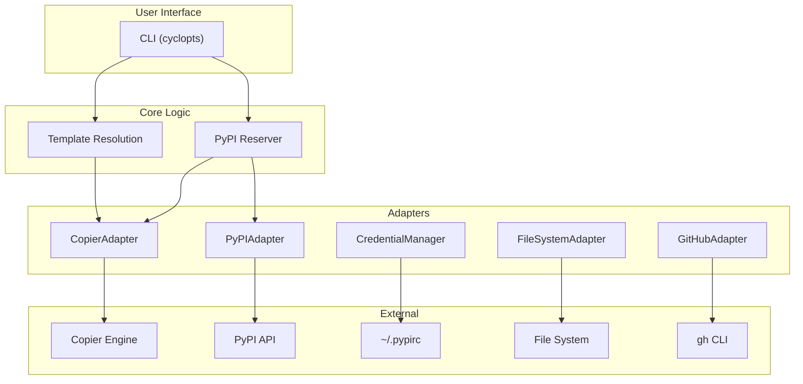

# Architecture

## Overview

`axm-init` follows a layered architecture with clear separation of concerns:

## Layers

### 1. CLI (`cli.py`)

Cyclopts-based commands with input validation and formatted output (text + JSON).

### 2. Core Logic (`core/`)

Business logic independent of I/O:

- **`templates.py`** — Template catalog and name → path resolution
- **`reserver.py`** — PyPI name reservation workflow (check → build → publish)

### 3. Adapters (`adapters/`)

Each adapter wraps a single external dependency:

| Adapter | Wraps | Purpose |
|---|---|---|
| `CopierAdapter` | `copier.run_copy()` | Template-based scaffolding |
| `PyPIAdapter` | PyPI JSON API | Package name availability check |
| `CredentialManager` | `PYPI_API_TOKEN` / `~/.pypirc` | Token retrieval and validation |
| `FileSystemAdapter` | `pathlib` | File operations with rollback |
| `GitHubAdapter` | `gh` CLI | Repo creation, secrets, Pages |

### 4. Models (`models/`)

Pydantic models for structured data exchange between layers:

- `ScaffoldResult` — Outcome of a scaffolding operation
- `CopierConfig` — Input configuration for Copier
- `ReserveResult` — Outcome of a PyPI reservation

## Design Decisions

| Decision | Rationale |
|---|---|
| Hexagonal architecture | Testable core, swappable adapters |
| Pydantic models | Validation, serialization, `extra = "forbid"` |
| Copier for scaffolding | Jinja2 templates, supports project updates |
| `src/` layout | PEP 621 best practice, no import conflicts |
