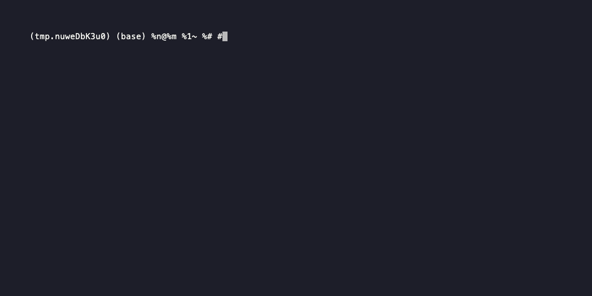

# Quick Start

This tutorial walks you through installing `axm-init` and creating your first project.

## Prerequisites

- Python 3.12+
- [uv](https://docs.astral.sh/uv/) (recommended) or pip

## Installation

```bash
uv add axm-init
```

Or with pip:

```bash
pip install axm-init
```

Verify the installation:

```bash
axm-init version
```

## Step 1: Create a New Project

Scaffold a fully configured Python project:

```bash
axm-init scaffold my-project \
  --org my-org --author "Your Name" --email "you@example.com"
```

You'll see output with all scaffolded files:

```
✅ Project 'my-project' created at /path/to/my-project
   📄 pyproject.toml
   📄 src/my_project/__init__.py
   📄 tests/__init__.py
   📄 README.md
```

!!! tip "Default name"
    If you omit `--name`, the project name defaults to the target directory name.

## Step 2: Explore the Scaffolded Project

```bash
cd my-project
tree -L 3
```

```
my-project/
├── pyproject.toml       # PEP 621, hatch-vcs, ruff, mypy, pytest
├── src/
│   └── my_project/
│       ├── __init__.py
│       └── py.typed
├── tests/
│   └── __init__.py
├── Makefile             # make lint, make test, make ci
├── mkdocs.yml           # Material for MkDocs + Diátaxis
└── docs/
    └── index.md
```

!!! note
    The actual scaffolded project contains additional files (CI workflows, pre-commit config,
    Makefile, docs setup). The tree above shows the essential structure.

!!! note "What's included"
    The scaffolded project comes pre-configured with:

    - **pyproject.toml** — PEP 621 metadata, hatch-vcs versioning, ruff, mypy, pytest
    - **Makefile** — `make lint`, `make test`, `make ci`
    - **MkDocs** — Material theme, Diátaxis nav, auto-gen API docs
    - **py.typed** — PEP 561 marker for type checkers

## Step 3: Run the Checks

```bash
cd my-project
make ci
```

`make ci` runs the full quality pipeline in sequence: **Ruff lint → MyPy type-check → Pytest**. It's equivalent to:

```bash
uv run ruff check src/ tests/
uv run mypy src/ tests/
uv run pytest
```

If everything passes, your project is ready for development.



## Next Steps

- [Scaffold a project](../howto/scaffold.md) — Options, flags, PyPI check
- [Reserve a package name](../howto/reserve.md) — Claim names on PyPI
- [Check your project](../howto/check.md) — Quality grade (A–F)
- [CLI Reference](../reference/cli.md) — Full command documentation
